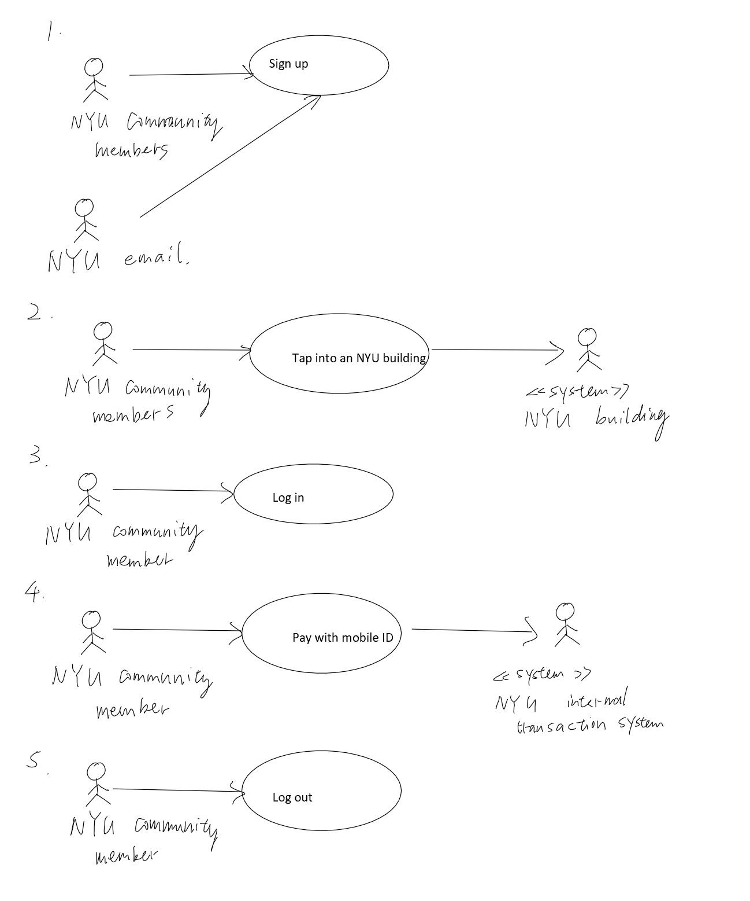
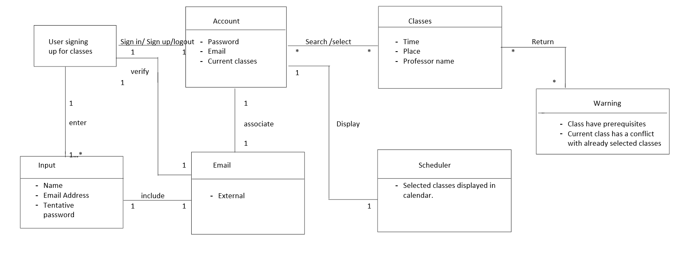

# Requirements  
---
## End User Observation  
---
### Mia Karnstein  
Age:18  
Address: 20 W 34th St, New York, NY 10001  
Background story: Grew up in NYC, doesn't like technologies. Firmly believes that she is a vampire  
School: NYU  
Occupation: Student  
Challenges: She has a busy schedule, she would like to have a schedule that she can modify so she knows which timeslot works for her.
Solution: Allow users to block out sections of the schedule so they have easier visualization on which timeslot works for them. 
  
### Eva Roux  
Age 21  
Address: 1600 Pennsylvania Ave NW, Washington, DC 20500  
Background story: Grew up in Washington DC, wants a career in business  
School: NYU Stern  
Occupation: Student  
Goal: She doesn't want to be picking for sections that are already full.
Solution: Have a special indicator that indicates which class is full/closed and how long is the waitlist.
  
### Emily Sue  
Age 19  
Address: 110 E 14th St, New York, NY 10003  
Background Story: Grew uo in new york,dormed at NYU and is forced to get a meal plan that she can not use up  
School: NYU  
Occupation: Student  
Goal: NYU has too many courses that she simply does not care about, she wants a cleaner catalog
Solution: Include a filiter so users are allowed to exclude certain school,subjects from her catalog

### Io 
Age 18
Address: 1 E 2nd St, New York, NY 10003
Background Story: Grew uo in Oklahoma, dormed at NYU, freshman  
School: NYU  
Occupation: Student  
Goal: She wants to major in math but never made past algebra 1 in high school, knows there is a lot of class that will have pre-requisit, want to know them ahead of time so she doesn't try to enroll in one.
Solution: If a requirement is not met, a warning message will display
  

## Use cases
### Use case descriptions
1. Sign up/Register
   - Actor: NYU community members, email
   - Scenario: The user needs to fill in the personal data required. If all data are accepted, the NYU email the person entered will receive the verification email. After the user clicked on the verification link, the new account will be set up. If the verification failed or the user entered invalid information, the page will display errors.
   

2. Log in
   - Actor: NYU community members
   - Scenario: The actor types in their net ID and their password. If the password is correct, he/she will be logged into his/her mobile ID account. If the password is incorrect, an error message will be displayed and he/she needs to log in again.

2. Course Selection
   - Actor: NYU Students, NYU course catalog
   - Scenario: When the actor wants to enroll in a course, he or she will select the course on the catalog screen, and the schedule for that particular course will be automatically displayed. He or she can proceed to validate their prefered time slot and enroll in the course
   - Precondition: user is logged in to their account

5. Log out
   - Actor: NYU community members
   - Scenarios: When the user is logged into their account, he/she can click on the logout button and be logged out of the system
   - Precondition: user is logged in to their account.

### Use case Diagram

## Domain Modeling

